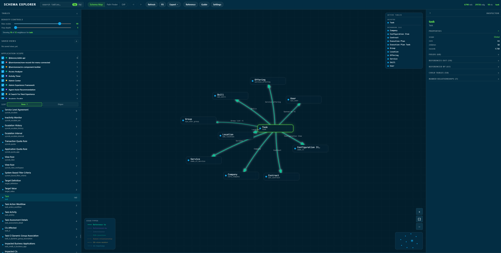
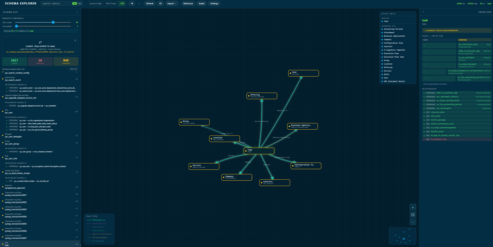
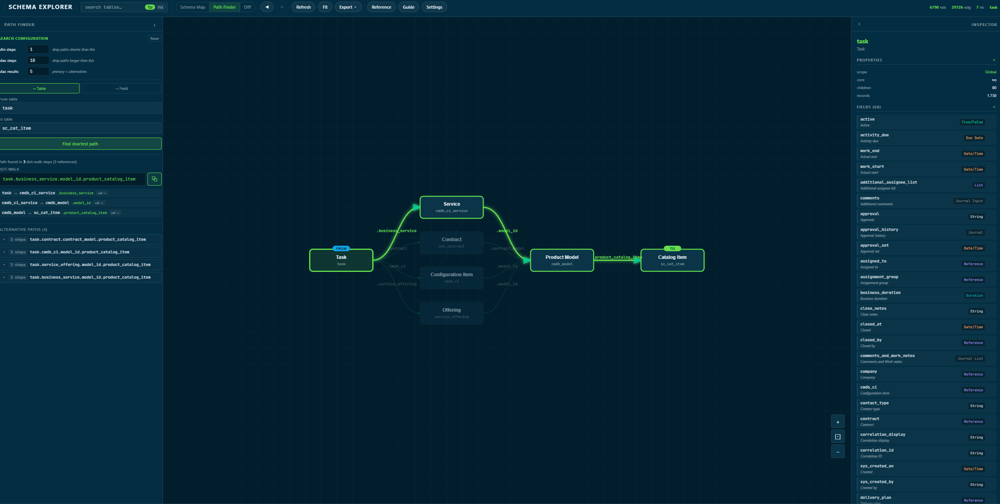

# Schema Explorer for ServiceNow

[](LICENSE)

Visualise your ServiceNow table schema — inheritance chains, reference fields,
M2M relationships, CMDB CI topology — in a single self-contained HTML file.
No installation, no server, no external dependencies.

> **Community tool** — not developed, endorsed, or affiliated with ServiceNow, Inc.

## Features

- Force-directed Schema Map with adjustable hop depth, max nodes, and edge-type filters
- Advanced filter builder — narrow the canvas by scope, table type, table access, name, field, edge type, field count, or custom prefix
- Inspect any table's fields, types, inheritance chain, references, M2M links, and CMDB CI topology
- Search by table name **or** field name across the full dataset
- Path Finder — shortest dot-walk path between any two tables or to a specific field; hop exclusions to suppress hub tables
- Schema Diff — compare two registered instances to see added, removed, and changed tables/fields
- Configuration Data — view and reconcile plugins, store apps, custom apps, and system properties across your registered instances; available from a single instance (one column) and lights up version drift, missing entries, active-state mismatches, and the store-app update signal as you add more; an **Instance Data** tab compares instance identity/runtime/export metadata and schema stats side by side, and the header instance dropdown (base) + **Compare** multi-select choose which instances to compare — the same controls as the Schema Map; export the active section as CSV or JSON from the header **Export** bar
- Saved Views — snapshot and restore named view configurations
- Export as PNG, SVG, JSON, Markdown, JSON-LD, OWL/Turtle, or OpenAPI YAML — and, while a comparison is active, fold the diff into any data export (Include comparison) or export the diff on its own (the **Comparison** scope), choosing which compares to include
- Custom colour-coded export background with opacity control, plus an optional **Legend** embedded in PNG/SVG exports — edge types, and a Differences (Added/Removed/Changed) key while a comparison is active. PNG/SVG also carry the on-canvas diff colouring.
- CMDB CI topology edges and ServiceNow Data Model Reference (CSDM 5)
- Optional update check — a dismissible footer badge when a newer release is available (toggle in Settings; no telemetry)





## Getting the tool

One file does everything. Download `sn_schema_explorer.html` from [Releases](../../releases).

It includes the Schema Map, Inspector, Path Finder, Schema Diff, Export, Settings, Guide,
and Setup Instructions (with the exporter scripts embedded for easy copy-paste,
plus a small form to configure the background script's CONFIG block before you copy it).

## Exporting your schema from ServiceNow

### Option A — Background Script (recommended)

Requires the `admin` role. No instance-side configuration needed.

1. Navigate to **System Definition → Scripts - Background**
2. Switch the application scope picker to **Global**
3. Paste the Background Script (copy from the **Setup Instructions** tab inside `sn_schema_explorer.html`)
4. Make sure **Execute in sandbox?** is unchecked — sandbox mode blocks the attachment write
5. Click **Run script** — takes 45–90 s on a typical instance
6. The output is saved as a JSON attachment on your user record; download it from **Self-Service → My Profile → Attachments**

> The Background Script supports `json`, `markdown`, and `jsonld` output only.
> OWL/Turtle and OpenAPI are unavailable here (their serialisers are too complex
> for the ES5/Rhino engine) — export JSON and convert in the viewer
> (**Export → OWL/Turtle** or **OpenAPI**), or use the Node.js extractor with
> `--format=owl|openapi`.

To include the optional [cross-instance metadata sections](#cross-instance-metadata-sections),
edit the `CONFIG` block at the top of the script: set
`metadataSections: ['plugins', 'storeApps', 'customApps', 'properties']` (any
subset). `sys_properties` values are off by default — set
`includePropertyValues: true` to include them (still denylist-redacted via
`propertyValueDenylist`), and optionally narrow rows with `propertyEncodedQuery`.
Metadata is emitted for the `json` format only. The shape is identical to the
Node extractor's, so both feed the same cross-instance comparison in the viewer.

### Option B — Node.js extractor

Requires Node.js 18+ and network access to your instance.

> **Secrets are passed via environment variables, not flags.** The extractor
> refuses `--password` / `--apikey` on the command line because they leak into
> shell history and process listings. Use `SN_PASSWORD` / `SN_APIKEY` instead.

```bash
# Basic Auth
SN_PASSWORD='***' node sn-schema-export.node.standalone.js \
  --instance=https://your-instance.service-now.com \
  --user=admin \
  --output=schema.json

# API key auth (alternative to user/password)
SN_APIKEY='<sn_api_key>' node sn-schema-export.node.standalone.js \
  --instance=https://your-instance.service-now.com \
  --output=schema.json
```

Key flags:

| Flag                        | Default              | Description                                                            |
| --------------------------- | -------------------- | ---------------------------------------------------------------------- |
| `--instance`                | —                    | Instance URL (required)                                                |
| `--user`                    | —                    | Basic Auth username (password via `SN_PASSWORD`)                       |
| `--output`                  | _(format-dependent)_ | Output file path                                                       |
| `--format`                  | `json`               | Output format: `json` · `markdown` · `jsonld` · `owl` · `openapi`      |
| `--edge-types`              | all six              | Comma-separated subset of `reference,extends,m2m,rel,view,cmdb_rel`    |
| `--include-record-counts`   | off                  | Add per-table record counts (adds 5–15 min)                            |
| `--metadata`                | _(none)_             | Opt-in sections: `plugins,storeApps,customApps,properties` (JSON only) |
| `--include-property-values` | off                  | Include `sys_properties` values (denylist-redacted); off by default    |
| `--property-query`          | _(none)_             | Encoded query narrowing which `sys_properties` rows export             |
| `--page-size`               | `1000`               | Rows per API request                                                   |

Credentials are supplied through environment variables only: `SN_PASSWORD`
(Basic auth) or `SN_APIKEY` (API key auth).

When `--output` is omitted the filename is derived from the format: `sn_schema_export.json`, `.md`, `.jsonld`, `.ttl`, or `.yaml`.

Other environment variable equivalents: `SN_INSTANCE`, `SN_USER`, `SN_OUTPUT`, `SN_FORMAT`, `SN_EDGE_TYPES`, `SN_PAGE_SIZE`, `SN_METADATA`, `SN_PROPERTY_QUERY`.

### Cross-instance metadata sections

`--metadata` adds opt-in sections to the JSON export under a top-level
`_metadata` key, with capability flags under `_capabilities.metadata.<section>`.
These describe the instance beyond its table schema — installed **plugins**,
**store apps**, **custom apps**, and **system properties** — and power
cross-instance comparison in the viewer. Each entry carries its version and
active state; store apps also include `latestVersion` / `updateAvailable` (the
"update available" signal) and install/update dates, plugins an install date,
and custom apps install/update dates. Sections are emitted only when requested,
and each fetch degrades gracefully on instances missing the source table.

`sys_properties` values can hold secrets, so **values are off by default**
(names + metadata only). `--include-property-values` opts in, and even then a
central denylist (`password|secret|key|token|cred|private|passwd`) redacts
matching property values; `_capabilities.metadata.properties` reports
`valuesIncluded` and `redactedCount`. Metadata is **JSON-only** — the markdown,
JSON-LD, OWL, and OpenAPI formats ignore it.

Copy the extractor script from the **Setup Instructions** tab inside `sn_schema_explorer.html`, or find it in `dist/exporter/` after a build.

## Loading and exploring

1. Open `sn_schema_explorer.html` in any modern browser — it opens on the **landing page**
2. Drag and drop one or more `schema.json` exports onto the **Add instance** card (or click to browse). Each load registers an **instance card** showing the sections it contains (Schema / Plugins / Store apps / Custom apps / Properties); click **or load demo** to try a sample
3. Click the **Schema Explorer** icon on an instance card to visualise it — click any table to inspect it
4. Use the **Max Nodes** and **Hop Depth** sliders to control graph density
5. Use **Filter** in the header to narrow the canvas by scope, type, field, or edge
6. Enable **Path Finder** or **Schema Diff** via **Settings → Features**
7. Switch between tools (Schema Map, Path Finder, Schema Diff, Configuration Data) from the **tool switcher** in the header, and switch the loaded instance from the **instance dropdown** beside it
8. Use the **Home** button in the header to return to the landing page — register more instances or switch tools

Register multiple instance exports to compare across them; tool tiles light up when enough instances carry the data they need. Large schemas are split into a manifest + `.part*.json` files — drop all files at once and the loader reassembles them automatically.

## Build from source

Prerequisites: Node.js 20+ (the dev toolchain requires it; the standalone
exporter artifact still runs on Node 18+), npm

```bash
git clone https://github.com/revampd/sn-schema-explorer.git
cd sn-schema-explorer
npm install
npm run build        # builds all targets
```

Output lands in `dist/`. Individual targets:

```bash
npm run build:app      # dist/sn_schema_explorer.html
npm run build:export   # dist/exporter/* (bg script + node extractor)
```

## Development

```bash
npm run lint           # ESLint
npm run test:unit      # vitest unit tests
npm run test:coverage  # unit tests with coverage
npm run test:e2e       # Playwright e2e (build first; needs `npx playwright install chromium`)
npm test               # unit + e2e
```

See [CONTRIBUTING.md](CONTRIBUTING.md) for the full workflow, and
[CHANGELOG.md](CHANGELOG.md) for release history.

## Disclaimer

This project is an independent, community-built tool and is NOT developed, endorsed,
supported, or affiliated with ServiceNow, Inc. in any way. "ServiceNow" is a registered
trademark of ServiceNow, Inc. Use at your own risk.
